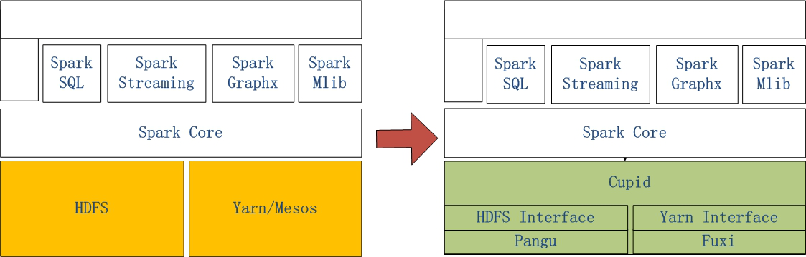

MaxCompute Spark是MaxCompute提供的兼容开源的Spark计算服务。它在统一的计算资源和数据集权限体系之上，提供Spark计算框架，支持用户以熟悉的开发使用方式提交运行Spark作业，以满足更丰富的数据处理分析场景。

# 关键特性

* 支持原生多版本Spark作业
> 社区原生Spark运行在MaxCompute里，完全兼容Spark的API，支持多个Spark版本同时运行。MaxCompute Spark提供原生的Spark WebUI供用户查看。

* 统一的计算资源
> MaxCompute Spark像MaxCompute SQL/MR等任务类型一样，运行在MaxCompute项目开通的统一计算资源中。

* 统一的数据和权限管理
> 完全遵循MaxCompute项目的权限体系，在访问用户权限范围内安全地查询数据。

* 与开源系统相同的使用体验
> MaxCompute Spark与社区开源Spark保持相同的体验（例如开源应用的UI界面、在线交互等），完全符合Spark用户使用习惯。开源应用的调试过程中需要使用开源UI，MaxCompute Spark提供原生的开源实时UI和查询历史日志的功能。其中，对于部分开源应用还支持交互式体验，在后台引擎运行后即可进行实时交互。

# 系统结构

MaxCompute Spark是阿里云通过Spark on MaxCompute的解决方案，让原生Spark能够运行在MaxCompute当中。

左侧是原生Spark的架构图，右边Spark on MaxCompute运行在阿里云自研的Cupid的平台之上，该平台可以原生支持开源社区Yarn所支持的计算框架，如Spark等。

# 约束与限制

目前MaxCompute Spark支持以下适用场景：

* 离线计算场景：GraphX、Mllib、RDD、Spark-SQL、PySpark等
* 读写MaxCompute Table
* 引用MaxCompute中的文件资源
* 读写VPC环境下的服务，如RDS、Redis、HBase、ECS上部署的服务等
* 读写OSS非结构化存储

暂不支持以下场景：

* 不支持交互式类需求Spark-Shell、Spark-SQL-Shell、PySpark-Shell等
* 不支持访问Maxcompute外部表，函数和UDF
* 只支持Local模式和Yarn-cluster模式运行