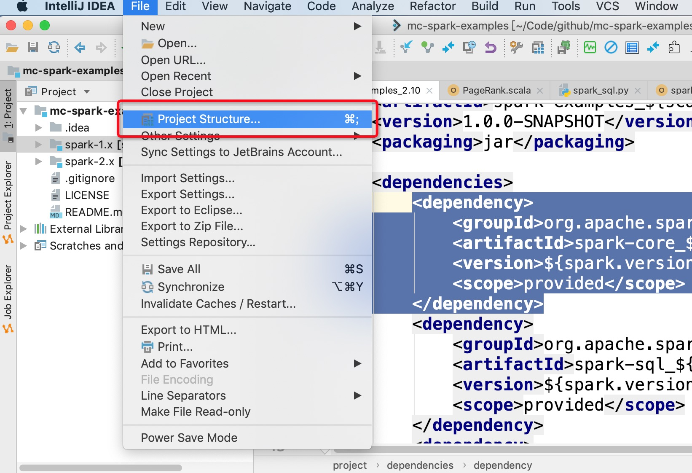
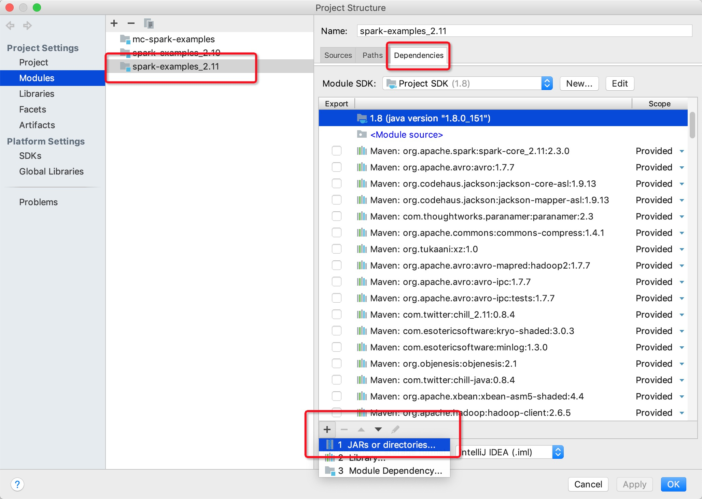
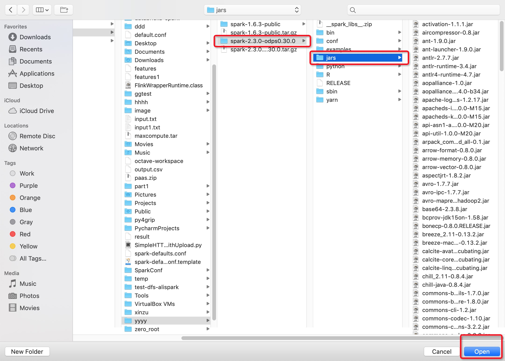
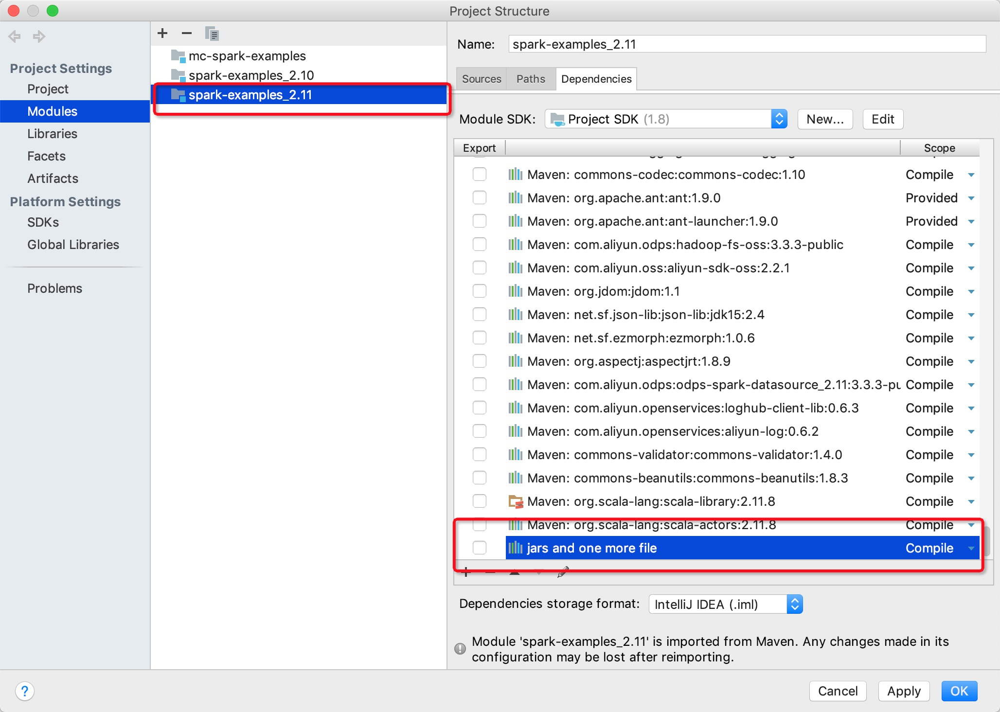
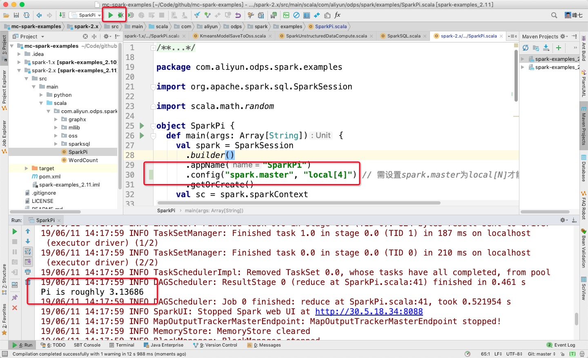

<h1 id="1">Local模式介绍</h1>

* MaxCompute Spark支持用户以原生的Spark Local模式进行任务调试

* 与Yarn Cluster模式类似，用户首先需要做以下准备工作
```
1. 准备MaxCompute项目以及对应的accessId，accessKey
2. 下载MaxCompute Spark客户端
3. 环境变量准备
4. spark-defaults.conf配置
5. 下载工程模版并编译
```

* 进行任务提交
```
## Java/Scala
cd $SPARK_HOME
./bin/spark-submit --master local[4] --class com.aliyun.odps.spark.examples.SparkPi \
/path/to/odps-spark-examples/spark-examples/target/spark-examples-2.0.0-SNAPSHOT-shaded.jar

## PySpark
cd $SPARK_HOME
./bin/spark-submit --master local[4] \
/path/to/odps-spark-examples/spark-examples/src/main/python/odps_table_rw.py
```
<h1 id="2">Local模式注意事项</h1>

```
1. Local模式读写Maxcompute表慢，这个原因是因为local模式是通过Tunnel来读写的，读写速度相比于yarn-cluster模式要慢

2. Local模式是在本地执行的，有的用户会经常遇到local模式下可以访问通vpc，但是在yarn-cluster模式下不行。
   显而易见，local模式是处于用户本机环境，网络没有隔离。而yarn-cluster模式是处于Maxcompute的网络隔离环境中，
   必须要要配置vpc访问的相关参数才行。

3. Local模式下访问vpc的endpoint通常是外网endpoint，而yarn-cluster模式下访问vpc的endpoint通常是vpc网络endpoint

4. IDEA Local模式下需要将相关配置写在代码中，而在Yarn-Cluster模式运行时一定要将这些配置从代码中去掉
```

<h1 id="3">IDEA Local模式执行</h1>

* Spark可以支持用户在IDEA里支持以Local[N]的模式直接运行代码，而不需要通过命令行提交，用户需要注意以下两点：
```
1. IDEA运行Local模式是不能直接引用spark-defaults.conf里的配置，需要手动在代码里指定相关配置

2. 一定要注意需要在IDEA里手动添加MaxCompute Spark客户端的相关依赖（jars目录），否则会出现以下报错：
   the value of spark.sql.catalogimplementation should be one of hive in-memory but was odps
```

### 1. 在代码需要手动设置spark config

```
### spark 2.3版本
val spark = SparkSession
      .builder()
      .appName("SparkPi")
      .config("spark.master", "local[4]") // 需设置spark.master为local[N]才能直接运行，N为并发数
      .config("spark.hadoop.odps.project.name", "****")
      .config("spark.hadoop.odps.access.id", "****")
      .config("spark.hadoop.odps.access.key", "****")
      .config("spark.sql.catalogImplementation", "odps")
      .config("spark.hadoop.odps.end.point", "http://service.cn.maxcompute.aliyun.com/api")
      .getOrCreate()

### 注意，如果使用spark 2.4.5及以上的版本，需要在代码中配置spark.sql.catalogImplementation=hive，不再需要在代码中配置spark.hadoop.odps.project.name，spark.hadoop.odps.access.id，spark.hadoop.odps.access.key，spark.hadoop.odps.end.point这几个参数
只要在代码的resources目录下（类加载器能加载的目录）创建一个名为odps.conf的文件，然后添加以下配置，注意在集群模式中需要将该文件删除：

odps.project.name=***
odps.access.id=***
odps.access.key=***
odps.end.point=***


```

### 2. 在IDEA里手动添加MaxCompute Spark客户端的相关依赖（下图无法显示请参考[文档](https://github.com/aliyun/MaxCompute-Spark/wiki/12.-Github%E5%9B%BE%E7%89%87%E6%97%A0%E6%B3%95%E8%AE%BF%E9%97%AE%E7%9A%84%E9%97%AE%E9%A2%98)）









