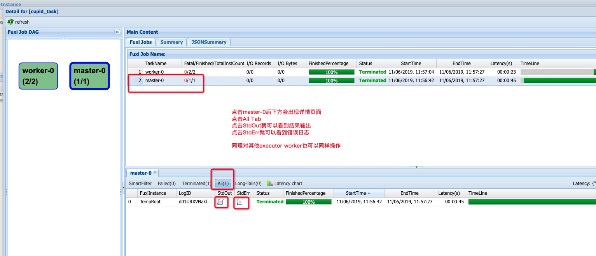
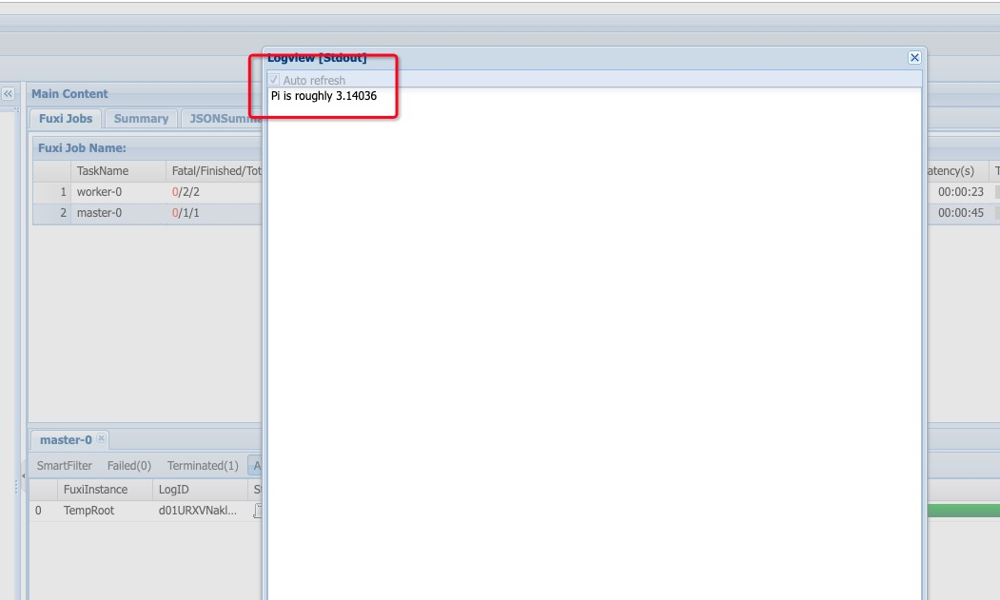
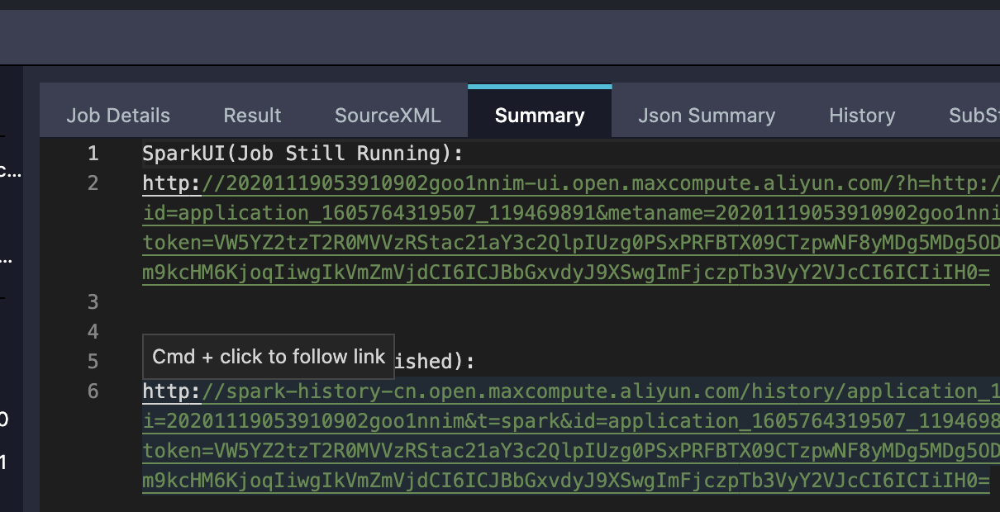
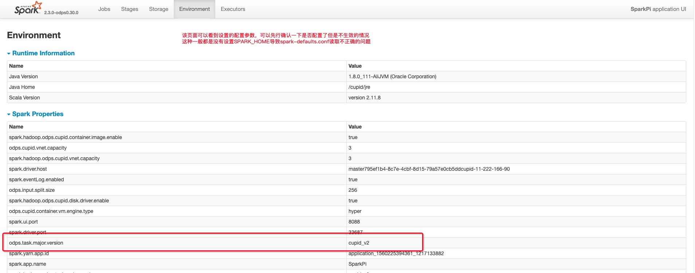
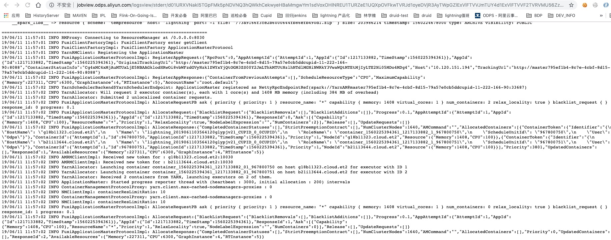

快速导航
  + [使用Logview工具诊断作业](#1)
  + [使用Spark-Web-UI诊断作业](#2)
  + [寻求开发介入帮助](#3)
------------------

提交作业后，一般来说客户端会输出logview和jobview这两个Url可以帮助作业诊断，这两个Url无论是问题自查、结果查看还是寻求开发人员帮助都是十分重要的手段。此外，用户还可以通过[Cupid Console](https://developer.aliyun.com/article/745038?spm=a2c6h.12873581.0.0.ebaa95b08Drzws&groupCode=maxcompute)来获取当前project正在运行的logview和jobview信息。
下面给出一个Demo日志作为演示。

```
19/06/11 11:56:41 INFO YarnClientImplUtil: logview url: http://logview.odps.aliyun.com/logview/?h=http://service.cn.maxcompute.aliyun.com/api&p=lightning&i=2019061103564120glypjv21&token=dUxYakFMRUFrc25oNjg5TDk1azhRZTlYVldvPSxPRFBTX09CTzpwNF8yNDcwNjM5MjQ1NDg0NDc5NzksMTU2MDQ4NDYwMSx7IlN0YXRlbWVudCI6W3siQWN0aW9uIjpbIm9kcHM6UmVhZCJdLCJFZmZlY3QiOiJBbGxvdyIsIlJlc291cmNlIjpbImFjczpvZHBzOio6cHJvamVjdHMvbGlnaHRuaW5nL2luc3RhbmNlcy8yMDE5MDYxMTAzNTY0MTIwZ2x5cGp2MjEiXX1dLCJWZXJzaW9uIjoiMSJ9
19/06/11 11:56:41 INFO CupidUtil: ready!!!
19/06/11 11:57:08 INFO YarnClientImpl: Submitted applicationType SPARK application application_1560225394361_1217133882 to ResourceManager at instanceId 2019061103564120glypjv21
19/06/11 11:57:09 INFO SubmitJobUtil: submitting CupidTask with ALIYUN type, operator: GetApplicationMeta
19/06/11 11:57:09 INFO CupidUtil: getApplicationMeta
19/06/11 11:57:11 INFO Client: Application report for application_1560225394361_1217133882 (state: RUNNING)
19/06/11 11:57:11 INFO Client: 
         client token: N/A
         diagnostics: diagnostics
         ApplicationMaster host: 11.222.166.90
         ApplicationMaster RPC port: 38965
         queue: queue
         start time: 1560225401092
         final status: UNDEFINED
         tracking URL: http://jobview.odps.aliyun.com/proxyview/jobview/?h=http://service.cn.maxcompute.aliyun-inc.com/api&p=lightning&i=2019061103564120glypjv21&t=spark&id=application_1560225394361_1217133882&metaname=2019061103564120glypjv21&token=MHJISzg3OVlKZWJTZ3VCSllzUEMzVnF5KzNJPSxPRFBTX09CTzpwNF8yNDcwNjM5MjQ1NDg0NDc5NzksMTU2MDQ4NDYzMSx7IlN0YXRlbWVudCI6W3siQWN0aW9uIjpbIm9kcHM6UmVhZCJdLCJFZmZlY3QiOiJBbGxvdyIsIlJlc291cmNlIjpbImFjczpvZHBzOio6cHJvamVjdHMvbGlnaHRuaW5nL2luc3RhbmNlcy8yMDE5MDYxMTAzNTY0MTIwZ2x5cGp2MjEiXX1dLCJWZXJzaW9uIjoiMSJ9
         user: user
```
### JobView
以`jobview.odps.aliyun.com`开头的Url，我们统称为Jobview，Jobview是上一代Spark UI和HistoryServer，使用时会在一些稳定性问题，因此**不再推荐**用户使用，可以直接在logview中找到Spark UI和History Server的链接来排查问题，见下文。

<h1 id="1">使用Logview工具诊断作业</h1>

以`logview.odps.aliyun.com`开头的Url，我们统称为Logview，这个MaxCompute自研的分布式作业Tracing工具，通过这个工具我们可以:

* 获取该作业状态
* 获取该作业各节点起停调度信息
* 获取该作业各节点的标准输入输出日志 (一般Spark结果输出建议打印到StdOut，Spark的log4j日志则默认输出到StdErr)
  + 通过log插件打印的日志会显示在StdErr中
  + 通过System.out.println()输出到控制台的日志会显示在StdOut中
* Logview的时效性一般是3～5天，甚至其中是StdOut、StdErr很可能会因为本地磁盘满了被清理掉

* **Logview 2.0包含Sensor功能，可以查看master以及每个worker在运行时的内存和cpu使用情况**

* 打开Logview，可以在浏览器看到以下页面，有作业完成状态以及时间等信息


* 点击Detail按钮可以查看作业进一步详情，master-0代表Spark Driver所在节点


* 点击master-0按钮并选择All Tab可以看到Spark Driver节点的具体信息


* 点击StdOut按钮可以看到节点结果输出


* 点击StdErr按钮可以看到节点log4j日志


<h1 id="2">使用Spark-Web-UI诊断作业</h1>

### Spark UI和History Server
用户可以在logivew的summary模块下找到Spark UI链接和History Server链接：


* 注意
```
1. Spark UI仅在作业运行时才能打开

2. History Server需要等待Driver把Event传递到HistoryServer进行渲染，会有一定延迟
```
* 打开该链接，可以在浏览器看到 Spark-Web-UI


* 点击environment tab确认设置的spark参数是否全部正确


* 点击executors tab重点关注是否有`Dead节点`，以及Driver的StdOut和StdErr


* 点击StdOut按钮可以看到节点结果输出


* 点击StdErr按钮可以看到节点log4j日志


<h1 id="3">寻求开发介入帮助</h1>

* 先根据[常见问题](https://github.com/aliyun/MaxCompute-Spark/wiki/06.-Spark%E5%B8%B8%E8%A7%81%E9%97%AE%E9%A2%98)文档做一下初步排查
* 提供logview和jobview，一般logview是一定有的，jobview如果提交的时候马上报错并不会产生
* 钉钉扫码加入MaxCompute Spark开发群支持