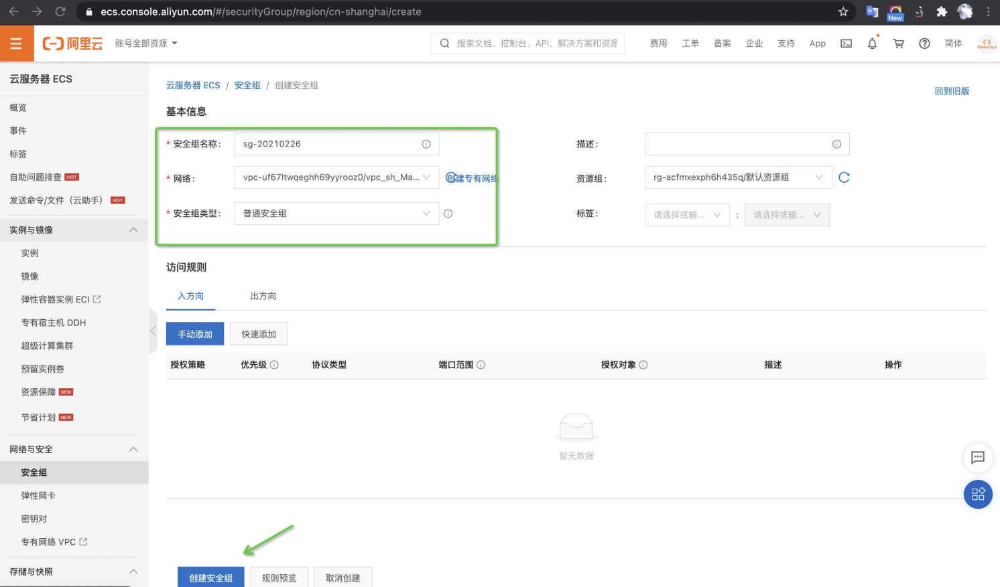

# 迁移意义
相比原先访问Aliyun VPC内的用户实例的方式（[文档](https://github.com/aliyun/MaxCompute-Spark/wiki/09.-VPC-Access文档说明)) ， ENI专线方式更加稳定，性能更好，且具备公网访问能力。

# 注意事项
（1）ENI专线可以打通一个VPC，如果用户作业需要同时访问多个VPC，则可以将 **已经通过ENI专线打通的Vpc** 与 **其他Vpc** 之间再做打通即可，详情咨询**阿里云专有网络相关的技术支持**。

（2）Spark作业运行所在 MaxCompute Project 的主账号 Uid 与目标 vpc 所属的主账号Uid必须一致，否则作业运行时会提示以下报错信息："You are not allowed to use this vpc - vpc owner and project owner must be the same person"。

# 迁移步骤
## 1.提供VPC相关的信息
用户需要提供：
- Vpc所在region: 例如：上海，杭州，北京等
- UserId: MaxCompute Project 所属的用户主账号 Id（同时也是目标Vpc所属的主账号Uid）
- VpcId: 即用户需要通过ENI专线打通的目标Vpc Id
- VSwitchId: 即目标Vpc中的一个交换机Id，可以在 Vpc 管理控制台界面创建/查看，若有多个从中选取一个即可
- SecurityGroupId：即目标Vpc中的一个安全组Id。**用户需要在目标Vpc下新建一个安全组**，用于对 MaxCompute Spark 访问 VPC 服务时进行访问控制

其中，新建安全组的流程如下所示：

a). 在目标 VPC 中，创建安全组：


b). 在目标 VPC 配置页面中，创建安全组（在页面下方）：


c). 在安全组列表中，进入“创建安全组”


d). 输入1.“安全组名称” 2.“网络” （请选择 MaxCompute 连接的目标 VPC） 3.“安全组类型” 选择普通安全组


e). 提供这个新建安全组的 id即可：


## 2.ENI授权
对ENI进行授权，该步授权的目的在于允许 MaxCompute 在用户 VPC 内创建 ENI 网卡，以实现 MaxCompute 到用户 VPC 的连通。
用户只要使用主账号在**登录态**下点击以下链接进行授权即可：
```
https://ram.console.aliyun.com/#/role/authorize?request=%7B%22Requests%22%3A%7B%22request1%22%3A%7B%22RoleName%22%3A%22AliyunODPSRoleForENI%22%2C%22TemplateId%22%3A%22AliyunODPSRoleForENI%22%7D%7D%2C%22ReturnUrl%22%3A%22https%3A%2F%2Fram.console.aliyun.com%2Froles%22%2C%22Service%22%3A%22ODPS%22%7D
```

## 3.等待MaxCompute平台官方人员为您完成专线开通

## 4.安全组规则配置
在ENI专线开通完成后，用户还需要在要访问的服务中增加相关安全规则，授权代表MaxCompute的那个安全组（即上述第1步中提供的安全组）能访问哪些服务的具体端口（比如9200, 31000等）。

例如：用户需要访问 阿里云 RDS，则需要在 RDS 中增加规则，允许第1步中创建的安全组访问。**如果用户需要访问的服务无法添加安全组，只能添加Ip**，那么需要将第一步中所使用的VSwitch网段都添加进来。

## 5.用户作业配置
运行spark作业，需要增加下面两个配置，就可以使用ENI专线连通目标VPC内的服务：
```
spark.hadoop.odps.cupid.eni.enable = true
spark.hadoop.odps.cupid.eni.info = cn-beijing:vpc-**********
这个配置格式是region:vpcid，其中vpcid就是前面打通ENI专线的那个vpcid
```
原先Spark作业中的VPC相关操作和配置**不再需要**：
```
spark.hadoop.odps.cupid.vpc.domain.list
spark.hadoop.odps.cupid.smartnat.enable
spark.hadoop.odps.cupid.pvtz.rolearn（访问自定义域名）
spark.hadoop.odps.cupid.vpc.usepvtz（访问自定义域名）
```