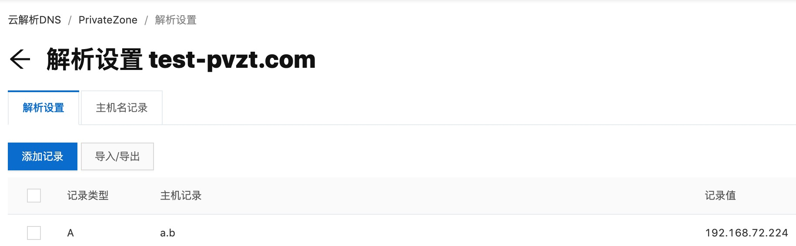
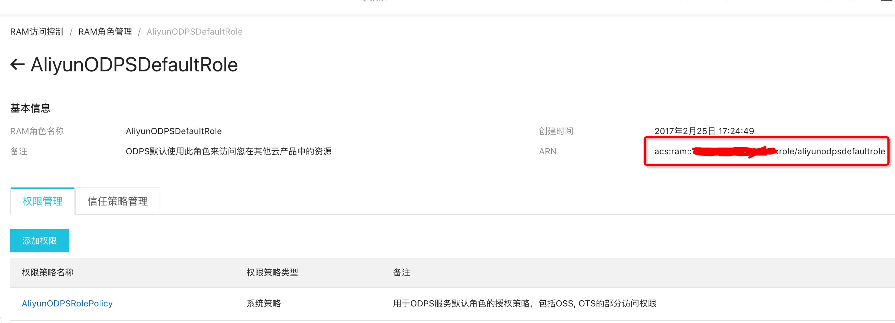
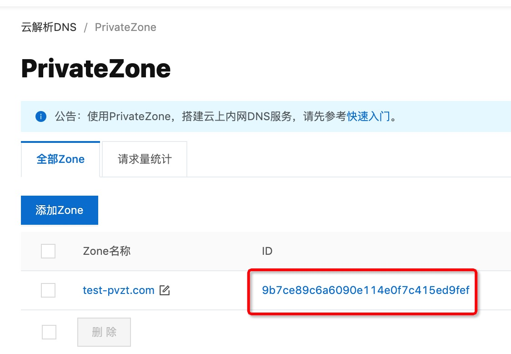

快速导航
  + [VPC访问说明](#1)
  + [Case1.访问MongoDB](#2)
  + [Case2.访问RDS](#3)
  + [Case3.访问HBase](#4)
  + [Case4.访问Redis](#5)
  + [Case5.访问Loghub](#6)
  + [Case6.访问Datahub](#7)
  + [Case7.访问自定义域名](#8)
  + [Case8.访问文件存储HDFS](#9)

-----------------

<h1 id="1">VPC访问说明</h1>
Spark on MaxCompute可以访问位于aliyun VPC内的用户实例，包括但不限于  

```
ECS, RDS, HBase, Redis, MongoDB, SLB...
```
还可以访问用户的自定义私有域名。

### 配置步骤如下：

1. 需要添加spark.hadoop.odps.cupid.vpc.domain.list配置，该配置描述了需要访问的一个或多个实例的网络情况。配置值为json格式，注意，需要把json压缩成一行。以下给出了若干示例，把[regionId](https://help.aliyun.com/document_detail/40654.html), vpcId, 实例域名，端口等替换成真实值即可。   

2. 在要访问的服务中添加ip白名单，允许100.104.0.0/16网段的访问   

**注意： 只能配置访问本Region下面vpc的服务，可以同时和多个vpc打通，可以跨region访问oss。必须要将配置压缩为一行，并且配置在spark-defaults.conf或dataworks的配置项中，而不能写在代码中！！！**

<h1 id="2">Case1.访问MongoDB</h1>
以下是一个访问mongoDB的例子，该mongo有主备两个实例

```
{
	"regionId": "cn-beijing",
	"vpcs": [{
		"vpcId": "vpc-2zeaeq21mb1dmkqh0exox",
		"zones": [{
			"urls": [{
					"domain": "dds-2ze3230cfea08be41.mongodb.rds.aliyuncs.com",
					"port": 3717
				},
				{
					"domain": "dds-2ze3230cfea08be42.mongodb.rds.aliyuncs.com",
					"port": 3717
				}
			]
		}]
	}, {
		"zones": [{
			"urls": [{
				"domain": "xxxxx.oss-cn-hangzhou-internal.aliyuncs.com",
				"port": 80
			}]
		}]
	}]
}
```

<h1 id="3">Case2.访问RDS</h1>
以下是一个访问rds的例子

```
{
  "regionId":"cn-beijing",
  "vpcs":[
    {
      "vpcId":"vpc-2zeaeq21mb1dmkqh0exox",
      "zones":[
        {
          "urls":[
            {
              "domain":"rm-2zem49k73c54z7lu3.mysql.rds.aliyuncs.com",
              "port": 3306
            }
          ]
        }
      ]
    }
  ]
}
```

<h1 id="4">Case3.访问HBase</h1>
以下是一个访问HBase的例子
https://developer.aliyun.com/article/762724

```
{
  "regionId":"cn-beijing",
  "vpcs":[
    {
      "vpcId":"vpc-2zeaeq21mb1dmkqh0exox",
      "zones":[
        {
          "urls":[
            {
              "domain":"hb-2zecxg2ltnpeg8me4-master1-001.hbase.rds.aliyuncs.com",
              "port":2181
            },
            {
              "domain":"hb-2zecxg2ltnpeg8me4-master1-001.hbase.rds.aliyuncs.com",
              "port":16000
            },
            {
              "domain":"hb-2zecxg2ltnpeg8me4-master1-001.hbase.rds.aliyuncs.com",
              "port":16020
            },
            {
              "domain":"hb-2zecxg2ltnpeg8me4-master2-001.hbase.rds.aliyuncs.com",
              "port":2181
            },
            {
              "domain":"hb-2zecxg2ltnpeg8me4-master2-001.hbase.rds.aliyuncs.com",
              "port":16000
            },
            {
              "domain":"hb-2zecxg2ltnpeg8me4-master2-001.hbase.rds.aliyuncs.com",
              "port":16020
            },
            {
              "domain":"hb-2zecxg2ltnpeg8me4-master3-001.hbase.rds.aliyuncs.com",
              "port":2181
            },
            {
              "domain":"hb-2zecxg2ltnpeg8me4-master3-001.hbase.rds.aliyuncs.com",
              "port":16000
            },
            {
              "domain":"hb-2zecxg2ltnpeg8me4-master3-001.hbase.rds.aliyuncs.com",
              "port":16020
            },
            {
              "domain":"hb-2zecxg2ltnpeg8me4-core-001.hbase.rds.aliyuncs.com",
              "port":16020
            },
            {
              "domain":"hb-2zecxg2ltnpeg8me4-core-002.hbase.rds.aliyuncs.com",
              "port":16020
            }，
            {
              "domain":"hb-2zecxg2ltnpeg8me4-core-003.hbase.rds.aliyuncs.com",
              "port":16020
            }
          ]
        }
      ]
    }
  ]
}
```

<h1 id="5">Case4.访问Redis</h1>
以下是访问redis的例子

```
{
  "regionId":"cn-beijing",
  "vpcs":[
    {
      "vpcId":"vpc-2zeaeq21mb1dmkqh0exox",
      "zones":[
        {
          "urls":[
            {
              "domain":"r-2zebda0d3c05c1a4.redis.rds.aliyuncs.com",
              "port":3717
            }
          ]
        }
      ]
    }
  ]
}
```

<h1 id="6">Case5.访问Loghub</h1>

domain请使用loghub endpoint的**经典/VPC网络服务入口**，各region对应的endpoint参考 [此文档](https://help.aliyun.com/document_detail/29008.html#h2-url-2)。示例如下:

```
{
  "regionId":"cn-beijing",
  "vpcs":[
    {
      "zones":[
        {
          "urls":[
            {
              "domain":"cn-beijing-intranet.log.aliyuncs.com",
              "port":80
            }
          ]
        }
      ]
    }
  ]
}
```

<h1 id="7">Case6.访问Datahub</h1>

domain请使用datahub endpoint的 **经典网络ECS Endpoint**，各region对应的endpoint参考[此文档](https://help.aliyun.com/document_detail/47442.html#h2-datahub-1)。示例如下：

```
{
  "regionId":"cn-beijing",
  "vpcs":[
    {
      "zones":[
        {
          "urls":[
            {
              "domain":"dh-cn-beijing.aliyun-inc.com",
              "port":80
            }
          ]
        }
      ]
    }
  ]
}
```

<h1 id="8">Case7.访问自定义域名</h1>
假设用户在vpc内自定义了域名

```
a.b.com
```
并且想在spark中通过域名+端口来发起访问

```
a.b.com:80
```
在配置spark.hadoop.odps.cupid.vpc.domain.list之前，用户需要做两件事

1.在PrivateZone中填写域名到ip的映射，如下图:



2.给MaxCompute赋权只读PrivateZone。[一键授权](https://ram.console.aliyun.com/#/role/authorize?request=%7B%22Requests%22:%20%7B%22request1%22:%20%7B%22RoleName%22:%20%22AliyunODPSDefaultRole%22,%20%22TemplateId%22:%20%22DefaultRole%22%7D%7D,%20%22ReturnUrl%22:%20%22https:%2F%2Fodps.console.aliyun.com%2F%22,%20%22Service%22:%20%22ODPS%22%7D)

3.额外加两个参数

```
spark.hadoop.odps.cupid.pvtz.rolearn=acs:ram::xxxxxxxxxxx:role/aliyunodpsdefaultrole
spark.hadoop.odps.cupid.vpc.usepvtz=true
```

其中spark.hadoop.odps.cupid.pvtz.rolearn从 [RAM控制台](https://ram.console.aliyun.com/roles/AliyunODPSDefaultRole) 获取，截图如下:




domain.list的配置示例如下
```
{
  "regionId":"cn-beijing",
  "vpcs":[
    {
      "vpcId":"vpc-2zeaeq21mb1dmkqh0exox",
      "zones":[
        {
          "urls":[
            {
              "domain":"a.b.com",
              "port":80
            }
          ],
          "zoneId":"9b7ce89c6a6090e114e0f7c415ed9fef"
        }
      ]
    }
  ]
}
```
其中json中多传入了zoneId，值在PrivateZone控制台获取，截图如下:



<h1 id="9">Case8.访问文件存储HDFS</h1>
文件存储HDFS产品的使用可以参考官方文档： https://help.aliyun.com/document_detail/101333.html
在spark中使用只需要新增一个hdfs-site.xml，内容如下所示：

```
<?xml version="1.0"?>
<configuration>
    <property>
        <name>fs.defaultFS</name>
        <value>dfs://DfsMountpointDomainName:10290</value>
    </property>
    <property>
        <name>fs.dfs.impl</name>
        <value>com.alibaba.dfs.DistributedFileSystem</value>
    </property>
    <property>
        <name>fs.AbstractFileSystem.dfs.impl</name>
        <value>com.alibaba.dfs.DFS</value>
    </property>
</configuration>
```

另外在spark节点配置里面新增spark.hadoop.odps.cupid.vpc.domain.list的配置，注意，需要将namenode和datanode均添加进来，内容的json如下（配置时需要将json内容压缩到一行），

```
{
	"regionId": "cn-shanghai",
	"vpcs": [{
		"vpcId": "vpc-xxxxxx",
		"zones": [{
			"urls": [{
				"domain": "DfsMountpointDomainName",
				"port": 10290
			}]
		}]
	}]
}
```