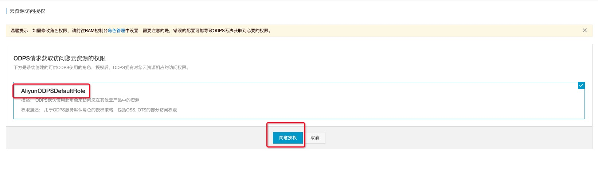
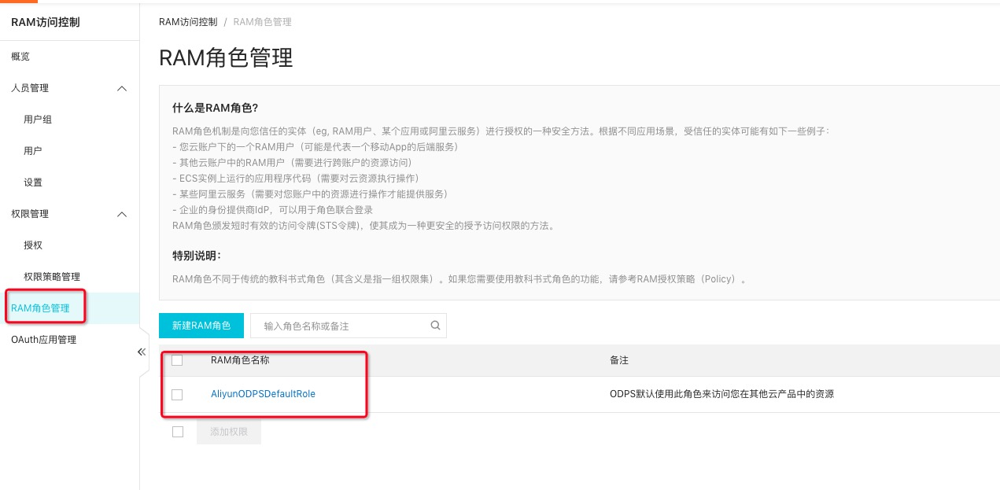
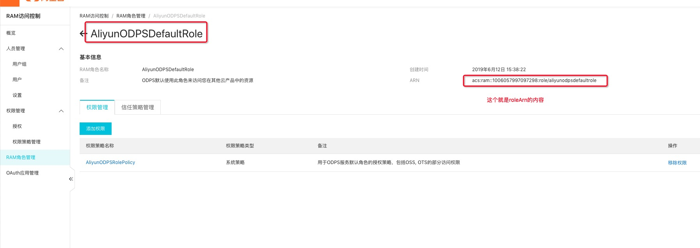

# Oss Access文档说明
## Oss Endpoint 配置

本机调试时使用对应Region的外网Endpoint，提交集群需替换为VPC内网Endpoint

[Region和Endpoint对照表](https://help.aliyun.com/document_detail/31837.html?spm=a2c4g.11174283.6.585.5f2d7da2svYAQx#title-qvx-r3a-xr4)

## 网络白名单配置
1. 默认情况下无需设置可以直接访问；
2. 如发现无法访问，设置 spark.hadoop.odps.cupid.trusted.services.access.list=[yourbucketname].oss-xxxxxx-internal.aliyuncs.com（yarn-cluster模式使用，该配置项必须放在配置文件或是命令行提交参数里）

## Oss Id/Key访问方式

```
spark.hadoop.fs.oss.accessKeyId = xxxxxx
spark.hadoop.fs.oss.accessKeySecret = xxxxxx
spark.hadoop.fs.oss.endpoint = oss-xxxxxx-internal.aliyuncs.com
```


## OssStsToken 授权访问方式
> 一般来说，Spark提供直接通过OSS AccessId以及AccessKey的方式直接访问OSS资源，但是此方式需要明文将AccessId以及AccessKey写在用户代码或者用户配置中，不是一种安全的访问方式，本文档提供一种更加安全的方式访问OSS资源

## 授权MaxCompute以StsToken的方式访问OSS

点击下方的一键授权链接，可以把当前云账号的OSS资源通过StsToken的方式授权给MaxCompute的Project直接访问，前提是，该MaxCompute的ProjectOwner也是此云账号

[一键授权](https://ram.console.aliyun.com/?spm=a2c4g.11186623.2.9.3bf06a064lrBYN#/role/authorize?request=%7B%22Requests%22:%20%7B%22request1%22:%20%7B%22RoleName%22:%20%22AliyunODPSDefaultRole%22,%20%22TemplateId%22:%20%22DefaultRole%22%7D%7D,%20%22ReturnUrl%22:%20%22https:%2F%2Fram.console.aliyun.com%2F%22,%20%22Service%22:%20%22ODPS%22%7D)

## 获取roleArn

通过上述的授权后，只需要在Spark配置里加上下面的配置就可以访问OSS资源

```
# 此配置表明Spark是通过StsToken去访问OSS资源
spark.hadoop.fs.oss.credentials.provider=org.apache.hadoop.fs.aliyun.oss.AliyunStsTokenCredentialsProvider

# 此配置是上述一键授权后产生的一个roleArn_ID，授权后可以去访问控制->角色管理获取AliyunODPSDefaultRole Arn信息
spark.hadoop.fs.oss.ststoken.roleArn=acs:ram::xxxxxxxxxxxxxxx:role/aliyunodpsdefaultrole

# 此配置是OSS资源对应的VPC访问endpoint 不同的region可能会不同
# 请访问 https://oss.console.aliyun.com/index 确认对应的 endpoint
spark.hadoop.fs.oss.endpoint=oss-cn-hangzhou-internal.aliyuncs.com
```

下面讲一下如何获取roleArn

* 登录 https://ram.console.aliyun.com/
* 点击角色管理
* 如果已经执行过一键授权，则会有一个**AliyunODPSDefaultRole**的记录存在
* 点击管理，页面会跳转到详情页，可以看到一个这样格式的ID `acs:ram::xxxxxxxxxxxxxxx:role/aliyunodpsdefaultrole`





