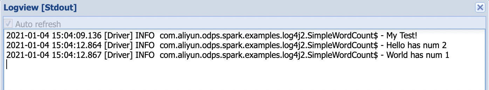
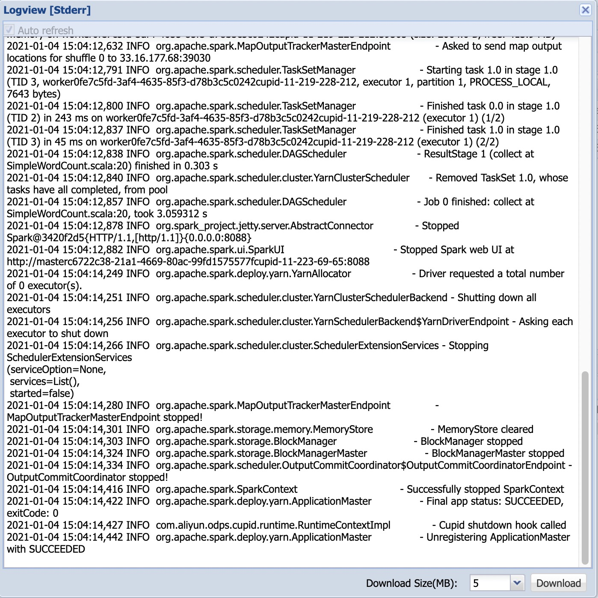

# MaxCompute Spark日志使用指南
## 背景
Spark集群运行环境中日志使用Log4j2接口，因此原先使用了Log4j1相关接口的代码需要一定的修改。

## 适用情况
- 有需要在代码中打入自己的日志，同时与Spark产生的系统日志进行区分的。
- 原代码中涉及显式调用Log4j1接口进行日志配置的

## 升级步骤
参考：[log4j2 example](https://github.com/aliyun/MaxCompute-Spark/tree/master/spark-2.x/src/main/scala/com/aliyun/odps/spark/examples/log4j2)
具体来说：
1. 引入log4j2的包
```xml
<dependency>
    <groupId>org.apache.logging.log4j</groupId>
    <artifactId>log4j-core</artifactId>
    <version>2.12.1</version>
    <scope>provided</scope>
</dependency>
```
保持scope为provided和version为2.12.1，因为集群环境中有此依赖，避免出现意外的类/方法冲突问题。

2. 参考[示例](https://github.com/aliyun/MaxCompute-Spark/blob/master/spark-2.x/src/main/java/com/aliyun/odps/spark/examples/utils/ConfigLog4j2.java)中使用log4j2的接口进行日志配置，即向集群运行环境中的log4j2配置中加入自定义的Appender和LoggerConfig

3. 使用之前调用配置方法，如下
```java
ConfigLog4j2.initPackageLogger("your_package_name")
```
即可在需要的地方使用，如下
```scala
val log: log4j.Logger = LogManager.getLogger(your_class)
```

## 效果展示
运行示例中的[SimpleWordCount](https://github.com/aliyun/MaxCompute-Spark/blob/master/spark-2.x/src/main/scala/com/aliyun/odps/spark/examples/log4j2/SimpleWordCount.scala)，自己在代码中打的日志收在logview->detail->master->stdout中，如下


logview->detail->master->stderr中仍是spark的系统日志，如下


## FAQ
1. 此示例需要开发者自行集成到代码中，涉及到的日志pattern等可自行修改。
2. initPackageLogger方法中传入的包名，也就是用户代码所处的包名，需要避开以下:
> * com.aliyun.odps
> * com.aliyun.odps.fs
> * org.apache.hadoop
> * org.apache.kafka
> * org.apache.zookeeper
> * org.apache.spark
> * org.apache.flink
> * akka
> * com.aliyun.odps.subprocess