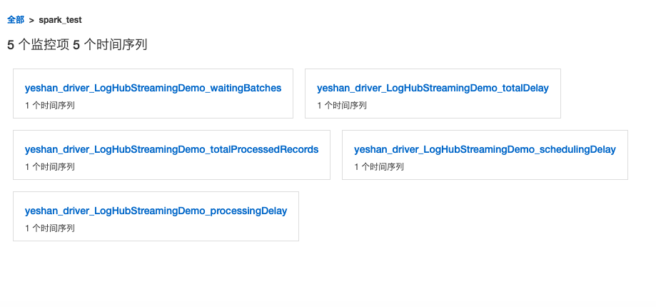
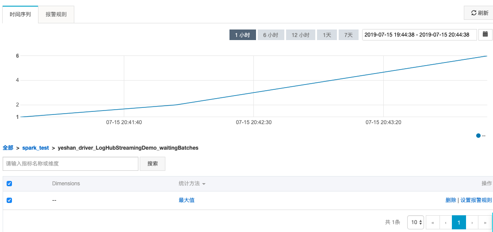
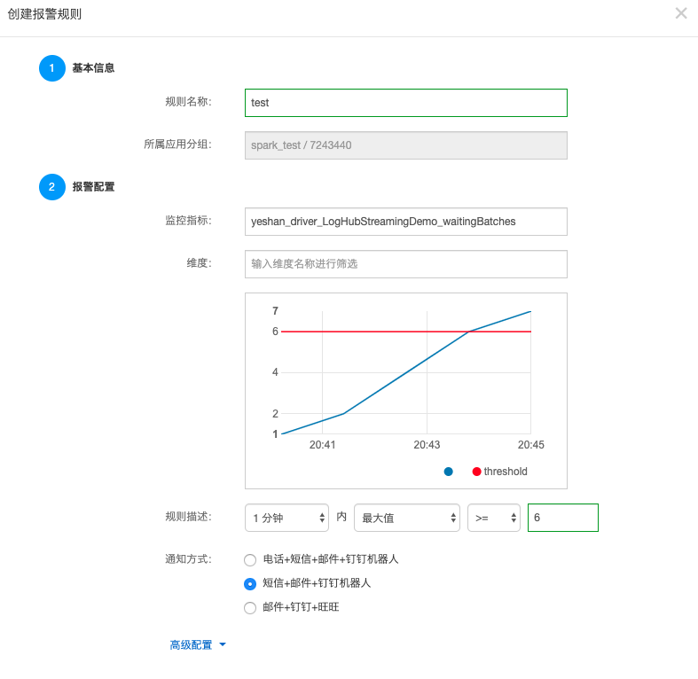

# Streaming作业监控报警
Spark Streaming作业的特点是长时间运行，对于数据处理速度，调度延迟等有着较高的要求。因而作业在生产环境运行时，需要关注一些作业的性能、延迟等相关的指标。

目前，MaxCompute的Spark Streaming作业的监控报警提供了一个对接云监控平台的插件，可以将作业关键的指标信息推送至[云监控平台](https://www.aliyun.com/product/jiankong)，进而可以进行指标查看以及配置监控报警信息，现在支持以下5种类型的监控报警。

* processingDelay ：处理延迟
* schedulingDelay ：调度延迟
* totalDelay：总延迟
* totalProcessedRecords：总共处理的记录条数
* waitingBatches：等待执行的Batch数
> 下面将对如何使用Spark Streaming的云监控插件做一个介绍。

（1）spark-cloudmonitor-sink这个插件是基于[Spark Metrics System](https://spark.apache.org/docs/latest/monitoring.html)的接口开发的一个外置插件。该插件的引入不影响Spark Streaming作业的开发，这里假定我们已经开发调试好了一个Spark Streaming作业，提交方式如下：
```
bin/spark-submit --class com.aliyun.odps.spark.examples.streaming.LogHubStreamingDemo --master yarn-cluster --num-executors 1 --driver-memory 4g --executor-memory 4g --executor-cores 1 spark-examples_2.11-1.0.0-SNAPSHOT-shaded.jar
```

（2） 使用spark-cloudmonitor-sink云监控插件，首先需要下载插件的jar包。
```
wget http://odps-repo.oss-cn-hangzhou.aliyuncs.com/spark%2Fspark-cloudmonitor-sink-1.0-SNAPSHOT-shaded.jar -O spark-cloudmonitor-sink-1.0-SNAPSHOT-shaded.jar
```

（3）配置云监控相关的账号信息，需要确保云监控平台已经创建好了一个应用分组。配置文件放置在conf/metrics.properties，配置信息如下
```
*.sink.cloudmonitor.period=5

*.sink.cloudmonitor.class=org.apache.spark.metrics.sink.CloudMonitorSink
*.sink.cloudmonitor.endpoint=http://xxxxxx
*.sink.cloudmonitor.accessid=xxxxxx
*.sink.cloudmonitor.accesskey=xxxxxx
*.sink.cloudmonitor.groupid=xxxxxx
```
其中sink.cloudmonitor.endpoint，sink.cloudmonitor.accessid，sink.cloudmonitor.accesskey，sink.cloudmonitor.groupid分别是云监控的endpoint，accessid，accesskey以及metrics需要推送到的应用分组id。
另外建议在conf/spark-defaults.conf里面增加spark.metrics.namespace: xxxxx 指定为一个有意义的名字标识，否则默认是ApplicationID, 每次作业提交都会不一样。

（4）带上云监控插件提交Spark Streaming作业，提交作业的命令如下：
```
bin/spark-submit --class com.aliyun.odps.spark.examples.streaming.LogHubStreamingDemo --master yarn-cluster --num-executors 1 --driver-memory 4g --executor-memory 4g --executor-cores 1 --jars spark-cloudmonitor-sink-0-SNAPSHOT-shaded.jar --files conf/metrics.properties spark-examples_2.11-1.0.0-SNAPSHOT-shaded.jar
```
和原来不带云监控插件的提交命令对比，可以看到只要新增插件的jar包和conf/metrics.properties配置即可。

（5）在云监控平台查看指标数据，以及配置报警。
当作业正常跑起来后，作业的指标数据会不断推送到云监控平台，在云监控的控制台，在自定义监控下面可以看到相应的Spark Streaming作业的监控数据，并且可以针对其中的指标添加相关的报警规则。




