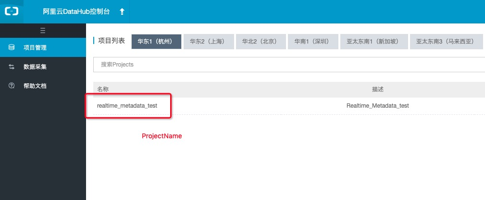
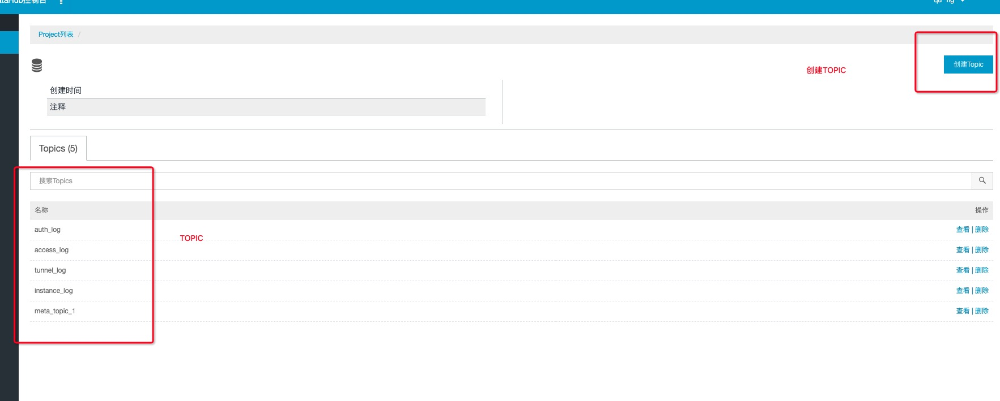
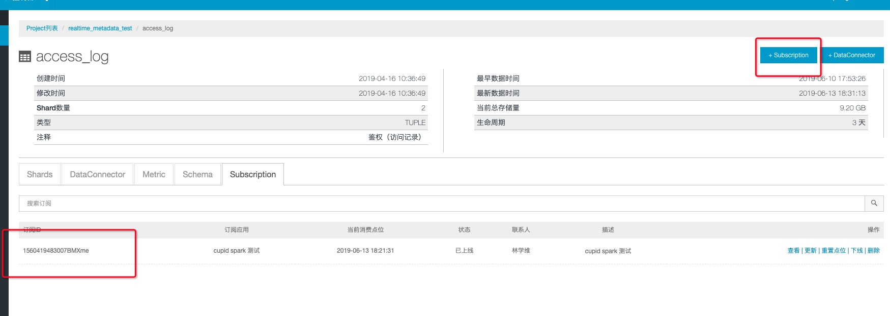

# Streaming读写DataHub
MaxCompute支持Spark Streaming(DStream)和Spark Structured Streaming，本文介绍Streaming作业流式接收DataHub数据源的示例。

## DataHub 数据源

首先, 得在阿里云DataHub拥有数据源，[DataHub控制台传送门](https://datahub.console.aliyun.com/datahub)

* 获取projectName


* 获取topic


* 获取subId

注意，每一个Streaming程序只能对应一个subId，如果有多个程序要读同一个topic，那么需要多个订阅



* 获取endPoint

每个region的endPoint都是不一样的，参考[如何配置EndPoint](https://help.aliyun.com/document_detail/47442.html?spm=5176.11065259.1996646101.searchclickresult.4a6e46e8r26UYT)

## Spark Streaming(DStream)

```
<!-- datahub streaming依赖 -->
<dependency>
    <groupId>com.aliyun.emr</groupId>
    <artifactId>emr-datahub_${scala.binary.version}</artifactId>
    <version>1.6.0</version>
</dependency>

<dependency>
    <groupId>com.aliyun.datahub</groupId>
    <artifactId>aliyun-sdk-datahub</artifactId>
    <version>2.9.4-public</version>
</dependency>
<!-- datahub streaming依赖 -->
```

[Streaming Access DataHub样例代码](https://github.com/aliyun/MaxCompute-Spark/blob/master/spark-2.x/src/main/scala/com/aliyun/odps/spark/examples/streaming/datahub/DataHubStreamingDemo.scala)

## 配置详解

```
val dataStream = DatahubUtils.createStream(
      ssc,
      "projectName",
      "topic",
      "subId",
      "accessId", // 云账号accessId
      "accessKey", // 云账号accessKey
      "endPoint",
      transferFunc(_), // 见Demo注释
      StorageLevel.MEMORY_AND_DISK
    )
```

## DataHub回流到MaxCompute
利用DStream+Dataframe可以把DataHub数据回流到MaxCompute

> 详细代码请参考：https://github.com/aliyun/MaxCompute-Spark/blob/master/spark-2.x/src/main/scala/com/aliyun/odps/spark/examples/streaming/datahub/DataHub2OdpsDemo.scala


## Spark Structured Streaming
> 详细代码请参考：https://github.com/aliyun/MaxCompute-Spark/blob/master/spark-2.x/src/main/scala/com/aliyun/odps/spark/examples/structuredStreaming/datahub/DatahubStructuredStreamingDemo.scala

source的示例如下(请参考代码):
```
val stream = spark.readStream
  .format("datahub")
  .option("datahub.endpoint", "http://....")
  .option("datahub.project", "project")
  .option("datahub.topic", "topic1")
  .option("datahub.accessId", "accessId")
  .option("datahub.accessKey", "accessKey")
  .option("datahub.startingoffsets", "latest")
  .option("datahub.maxoffsetsperTrigger", 20000) // optional
  .load()
```

sink的示例如下:
```
val query = spark.writeStream
  .format("datahub")
  .option("datahub.endpoint", "http://....")
  .option("datahub.project", "project")
  .option("datahub.topic", "topic1")
  .option("datahub.accessId", "accessId")
  .option("datahub.accessKey", "accessKey")
  .load()
```

其中datahub.endpoint请使用**经典网络ECS Endpoint**，各region对应的endpoint参考[此文](https://help.aliyun.com/document_detail/47442.html#h2-datahub-1)。此外，需要将endpoint配置在VPC访问配置中，参考[VPC访问](https://github.com/aliyun/MaxCompute-Spark/wiki/09.-VPC-Access%E6%96%87%E6%A1%A3%E8%AF%B4%E6%98%8E)。示例如下：
```
{
  "regionId":"cn-beijing",
  "vpcs":[
    {
      "zones":[
        {
          "urls":[
            {
              "domain":"dh-cn-beijing.aliyun-inc.com",
              "port":80
            }
          ]
        }
      ]
    }
  ]
}
```

**注意：** 目前所给的这个Demo，没有启用checkpoint，checkpoint需要使用oss作为checkpoint的存储，另外Spark Streaming作业处于试用阶段，**作业最长运行时间不能超过3天，如果需要投入长时间正式运行使用，请联系我们开通相关权限。**
