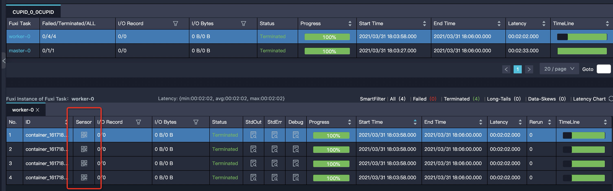
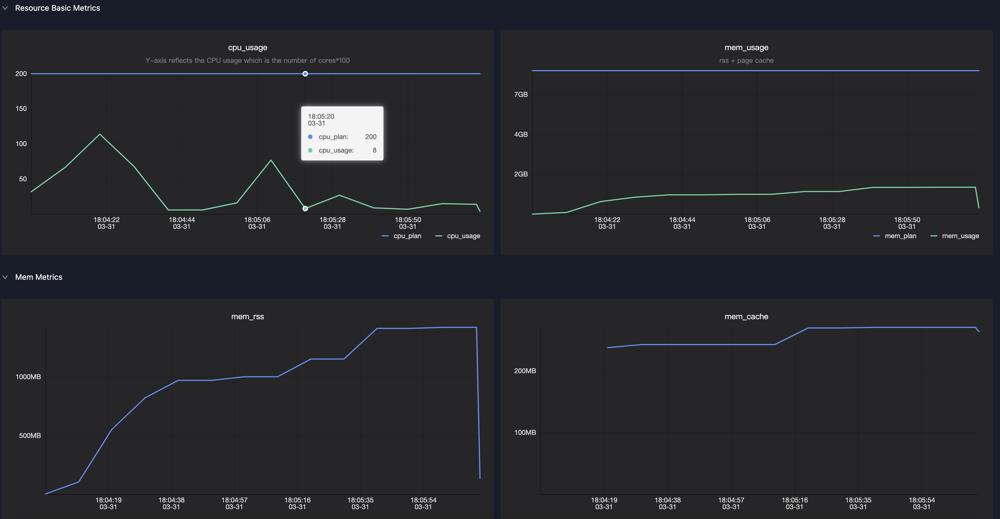
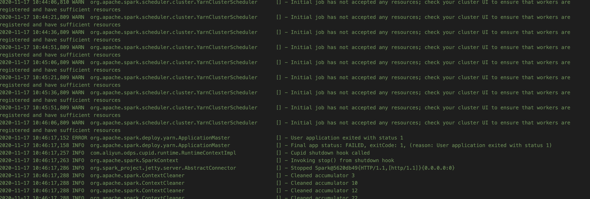
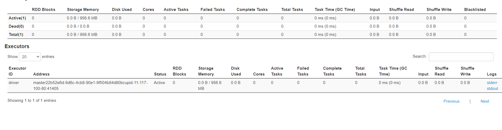

# 资源申请问题
<h1 id="1">资源申请</h1>
通常用户在提交Spark作业时需要关注以下几种资源：

* **Executor 数量**
* **Executor 内存**
* **Executor core**
* **Driver 内存**
* **Driver core**
* **本地网盘**

## Executor 相关参数
* spark.executor.instances
  + 总共申请的executor数目，普通任务十几个或者几十个足够了，若是处理大量数据时可以申请多一些，100—2000+
* spark.executor.cores
  + 每个executor的核数，即每个executor中的可同时运行的task数目
  + Spark任务的最大并行度是executor数目*executor core数
* spark.executor.memory
  + 代表申请executor的堆内内存，也就是启动jvm进程时设置的Xmx参数
* spark.executor.memoryOverhead
  + 申请executor的堆外内存，默认单位是MB，主要用于JVM自身，字符串, NIO Buffer等开销
  + 默认为executor Memory*0.1,最小384M
  + 如果遇到Cannot allocate memory，通常是堆外内存不足，可以考虑适当增大spark.executor.memoryOverhead
  + 注意：单个Executor的内存总量是spark.executor.memory+spark.executor.memoryOverhead

## Driver 相关参数
* spark.driver.cores
* spark.driver.memory
* spark.yarn.driver.memoryOverhead
* spark.driver.maxResultSize
  + 默认1g，控制worker送回driver的数据大小，一旦超出该限制，driver会终止执行
## 本地网盘参数
* spark.hadoop.odps.cupid.disk.driver.device_size
  + 代表本地网盘大小，默认值为20g
  + Spark使用网盘作为本地存储，Driver和每个Executor都有一个，Shuffle数据以及BlockManager溢出的数据均存储在网盘上
  + 当出现**No space left on device**时可适当调大该值，最大支持100g。如果调整到100g仍然会出现此错误，需要分析具体原因，可能是：1. 数据倾斜，在shuffle或者cache过程中数据集中分布在某些block；2. 可以缩小单个executor的并发（spark.executor.cores） 3. 增加executor的数量(spark.executor.instances)
  + **注意**  `必须配置在spark-conf文件或者dataworks的配置项中，不能配置在代码中`
 
<h1 id="2">如何合理设置资源参数</h1>

* 建议按照内存/CPU 1:4来申请资源，即1 core对应4GB内存，建议单个worker core数不要超过8 

* 用户可以通过查看logview中Master或Worker的Sensor来获取运行中的内存和CPU使用情况

* 通常需要关注mem_rss，代表了executor或driver在实际使用时的内存变化曲线，用户可以根据该值变化来判断是否需要增加/减少内存

<h1 id="3">资源等待</h1>

## 注意事项
* 用户在集群模式下必须配置spark.master=yarn-cluster才会正确的申请资源（注意local模式调试完之后要将代码中的spark.master=local配置去掉）

## 如何等待资源申请到之后提交Job
* 申请资源是一个持续不断的过程，因此可能会出现拿到的资源没有达到用户请求的数量，而spark是不会等到所有的Executor都获取到之后再开始执行任务，可以通过以下参数来控制Spark提交任务的时机
  + spark.scheduler.maxRegisteredResourcesWaitingTime：在执行前最大等待申请资源的时间，默认30s。
  + spark.scheduler.minRegisteredResourcesRatio：实际注册的资源数占预期需要的资源数的比例，默认0.8

## 申请不到资源的可能原因：
* 如果是预付费用户，一般是用户申请的资源超出了购买的资源数量，可以登陆管家进行确认
* 如果是后付费用户，需要抢占资源

## 申请不到资源解决方案
* 调整任务资源：调整用户申请的Executor总数或者单个Executor的资源数量（一般是内存）
* 合理安排任务执行时间

## 没有申请不到资源的几种现象

* 在driver端一般会打以下日志：
WARN YarnClusterScheduler: Initial job has not accepted any resources; check your cluster UI to ensure that workers are registered and have sufficient resources

* 在Logview中只能看到driver，而worker数量为0
* 在Spark ui中只能看到driver，而worker数量为0
