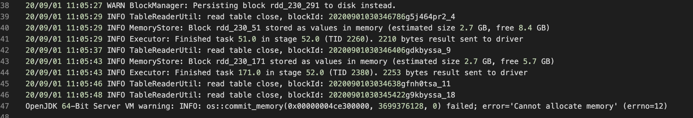

# 运行时OOM问题
<h1 id="1">OOM的一些情况</h1>

## 如何查看worker以及master的内存使用情况
Logview 2.0包含Sensor功能，可以查看master以及每个worker在运行时的内存和cpu使用情况

## Cannot allocate memory

1. 在某些Executor中出现Cannot allocate memory，一般是堆外内存不足，此时可以调整spark.yarn.executor.memoryOverhead参数
2. 在Driver中出现Cannot allocate memory，可以调整spark.yarn.driver.memoryOverhead参数

## java.lang.OutOfMemoryError: Java heap space
如果在Executor中出现该错误，通常是堆内内存不足，此时可以适当增大内存，或减少Executor core

## No route to host: workerd********* / Could not find CoarseGrainedScheduler
出现这类错误极有可能是某些Executor出现OOM

<h1 id="2">OOM解决方案</h1>

1. 限制executor 并行度，将cores 调小：多个同时运行的 Task 会共享一个Executor 的内存，使得单个 Task 可使用的内存减少，调小并行度能缓解内存压力
2. 增加单个Executor内存
3. 增加分区数量，减少每个executor负载
4. 考虑数据倾斜问题，因为数据倾斜导致某个 task 内存不足，其它 task 内存足够