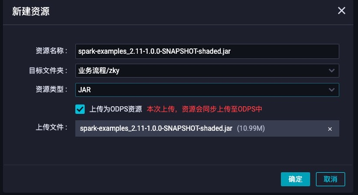
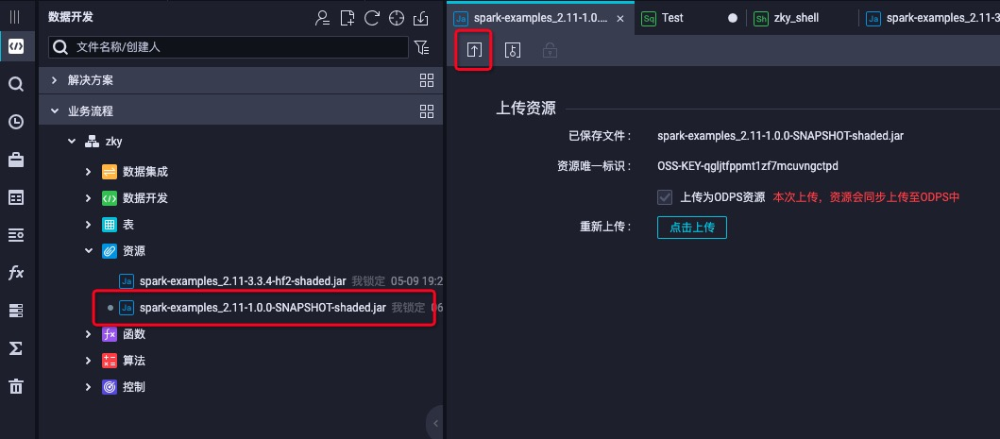
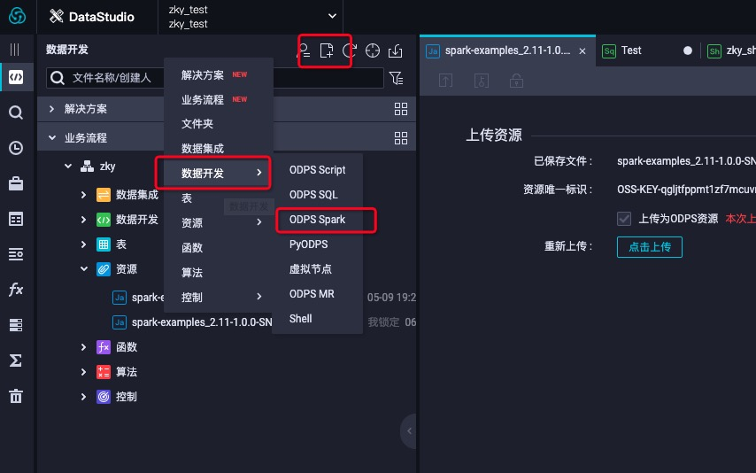
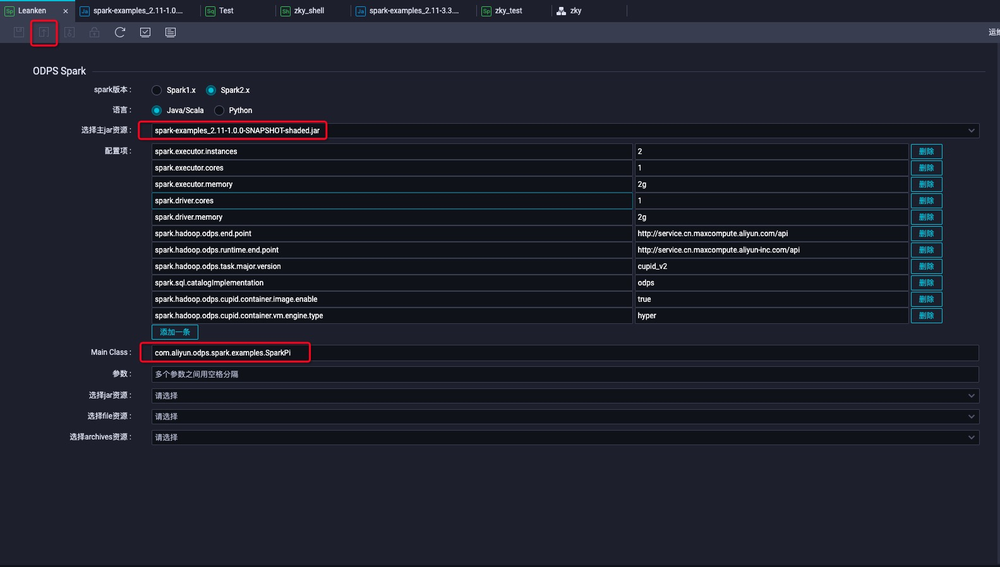
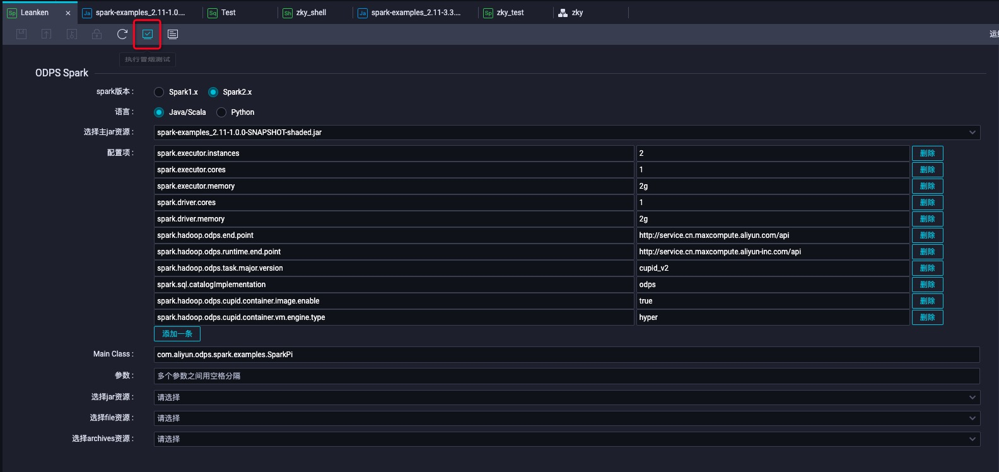
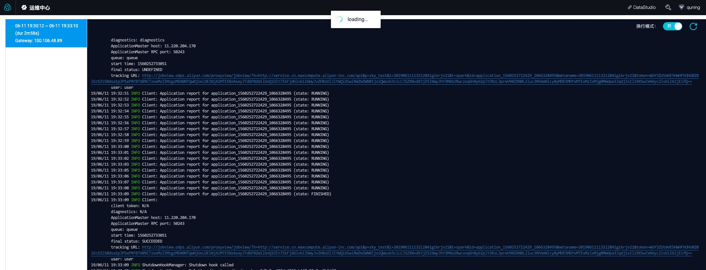

# Spark on Dataworks
<h1 id="1">Dataworks节点使用流程</h1>

* 创建资源


* 上传模板项目工程编译出来的jar包



* 上传之后一定要commit，也就是红色方框的按钮



* 创建ODPS Spark节点



* 选择刚才上传的资源并且按照spark-defaults.conf里面的配置填页面上的配置项，并提交



* 点击红色方框冒烟测试，冒烟测试按钮旁边的按钮可以查看运行日志



* 运行日志




<h1 id="1">Dataworks Spark节点配置</h1>

## ODPS SPARK节点介绍

本质上ODPS SPARK节点的配置对应于spark-submit命令的参数和选项。具体来说

| 节点 | spark-submit |
| --- | --- |
| 主java/python资源 | app jar or python file |
| 配置项 | --conf PROP=VALUE |
| main class | --class CLASS_NAME |
| 参数 | [app arguments] |
| 选择jar资源 | --jars JARS |
| 选择python资源 | --py-files PY_FILES |
| 选择file资源 | --files FILES |
| 选择archives资源 | --archives ARCHIVES |

## 配置项

配置项对应于spark-submit命令的--conf选项，其中：

* accessid，accesskey，projectname，endpoint无需配置，默认是生产账号（有特殊原因可显式配置，将覆盖默认值）

* 除此之外，需要将spark-default.conf中的配置逐条加到dataworks的配置项中

## 如何传参数(如bizdate)

* 同SQL节点，首先在调度->参数中添加参数

<br />

* 然后在Spark节点“参数”栏引用该参数，该参数会传给用户主类，用户在代码中解析该参数即可

Java/Scala:

<br />

Python:


## 资源上传

* 用户需要在DataWorks中添加任务需要的资源，这些资源在任务运行时会被上传到用户的工作目录下，资源可能包括：
```
1. jar资源/python资源：对应于spark-submit命令的--jars，--py-files，
2. file资源，对应于spark-submit命令的--files
3. archive资源：对应于spark-submit命令的--archives，archives会默认被解压，解压后的文件名等同于资源名去掉后缀。例如上传的资源名是mnist.zip，则解压名为mnist
```

* DataWorks中上传资源限制最大为50MB，如果需要使用更大的资源，用户需要将该资源通过[MaxCompute客户端](https://help.aliyun.com/document_detail/27971.html?spm=a2c4g.11174283.6.990.3158590eUSc7JU)上传为MaxCompute资源，然后将该资源添加到数据开发中，详见[文档](https://help.aliyun.com/document_detail/137575.html?spm=a2c4g.11186623.6.813.665b1861iN9oa8)

